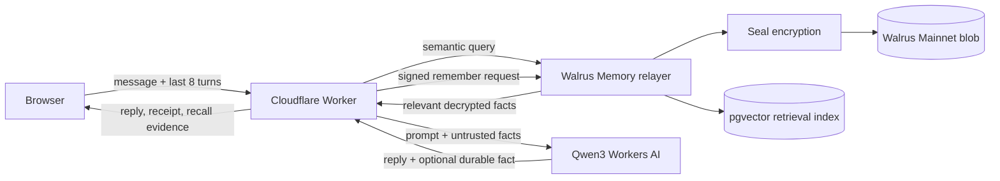

# Architecture and trust boundaries

## Data ownership

- The browser receives a random, HMAC-signed, HttpOnly identity cookie.
- Only the Worker derives the MemWal namespace; raw identities are never stored in memory text.
- One operator-owned MemWalAccount and revocable delegate key serve the application.
- The owner wallet key remains offline and is never a Worker secret.
- Walrus contains Seal-encrypted memory blobs. The managed relayer sees plaintext in the default SDK path because it performs embedding and encryption.

## Persistence model

- The transcript is ephemeral browser state.
- Each model turn may produce at most one durable fact.
- Durable facts are limited to goals, constraints, commitments, preferences, and progress.
- Greetings, secrets, contact details, financial data, medical data, and user-declined memories are excluded by prompt and validation policy.
- MemWal idempotency keys are SHA-256 hashes of namespace plus normalized memory text.

## Failure model

- Recall failures produce a normal generic answer and a visible degraded-memory status.
- AI failures return a neutral retry message and do not write memory.
- Writes are asynchronous in ordinary chat; the browser polls until `done` or a terminal failure.
- The autonomous demo waits for durable completion before starting session two.
- No endpoint returns delegate keys, internal prompts, namespaces, stack traces, or raw provider errors.
